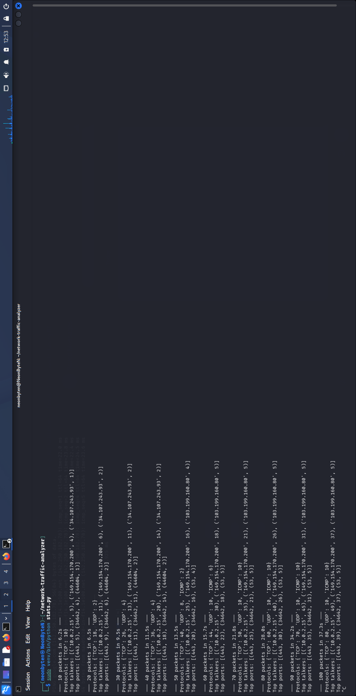
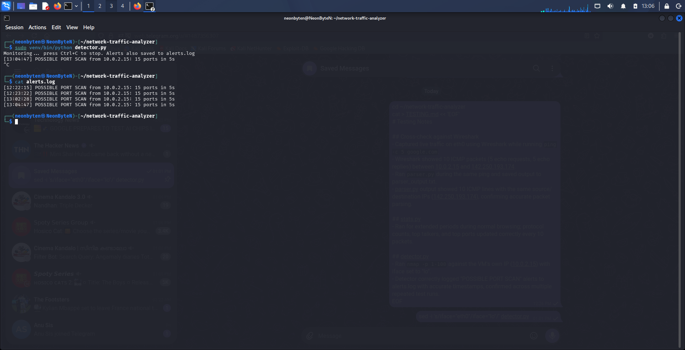

# Network Traffic Analyzer

A Python tool built with Scapy that captures live network traffic, parses packet details, tracks live statistics, and detects suspicious activity like port scans and DNS floods.

## Features
- sniffer.py — captures raw packets and prints a summary
- parser.py — extracts protocol, source/destination IP, ports, and packet size into a clean table
- stats.py — tracks live protocol counts, top talkers, and top ports, updating every 10 packets
- detector.py — detects possible port scans and unusual DNS activity in real time, logging alerts with timestamps to alerts.log

## How it works
Each script uses Scapy's sniff() to capture packets on a network interface. detector.py tracks per-source activity in sliding time windows to flag abnormal behavior: many unique ports contacted by one IP within a few seconds (port scan), or an unusually high rate of DNS queries from one IP (possible DNS tunneling or malware beaconing).

## Usage
`bash
python3 -m venv venv
source venv/bin/activate
pip install scapy

sudo venv/bin/python sniffer.py
sudo venv/bin/python parser.py
sudo venv/bin/python stats.py
sudo venv/bin/python detector.py
Root privileges are required for raw packet capture.

## Testing
See [TESTING.md](TESTING.md) for verification against Wireshark and detection test results.

## Screenshots

## Built by
Nandan A D — built as a hands-on SOC analyst project to practice packet analysis, protocol parsing, and basic intrusion detection concepts.
